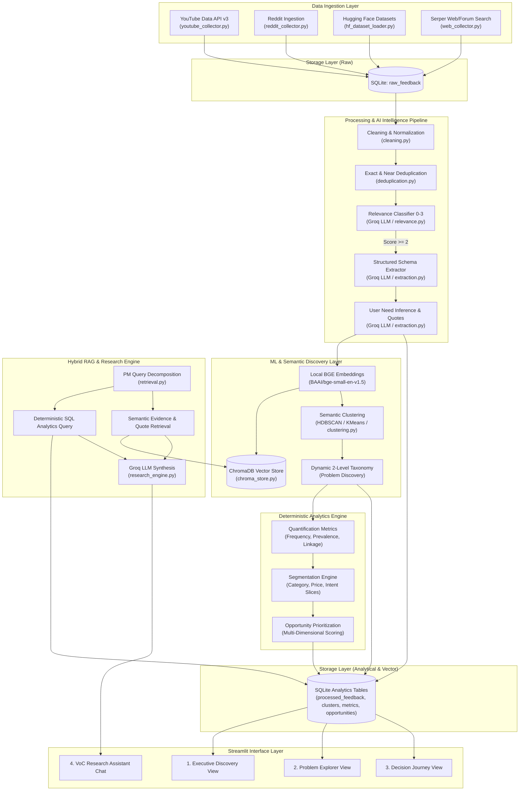
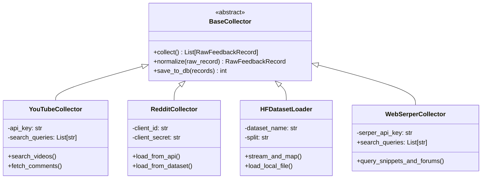
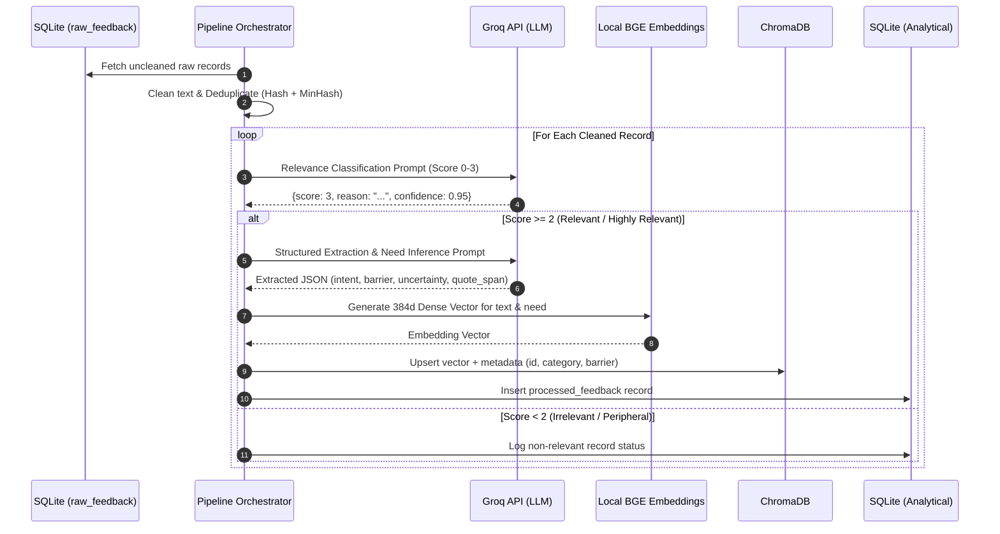
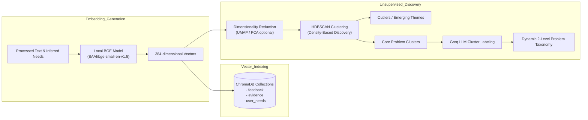
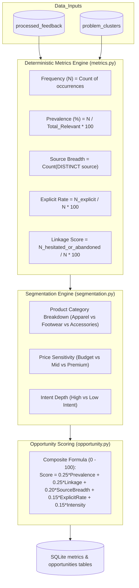
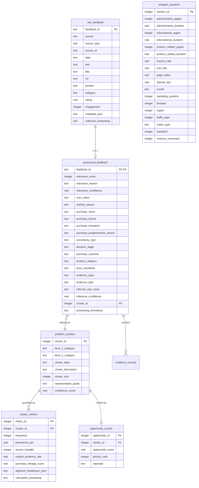
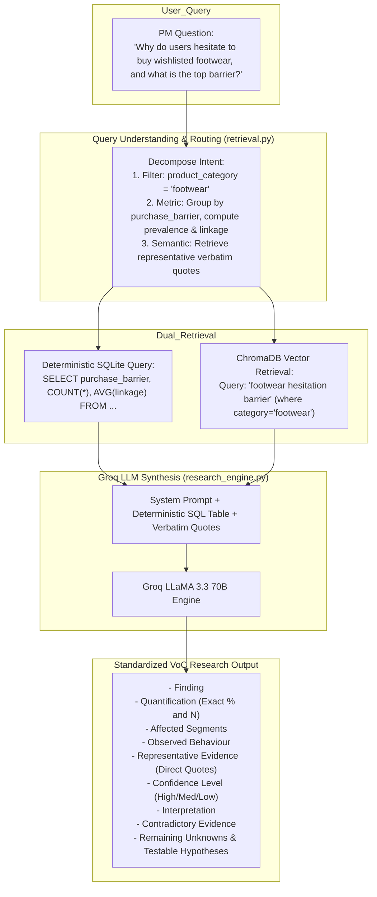
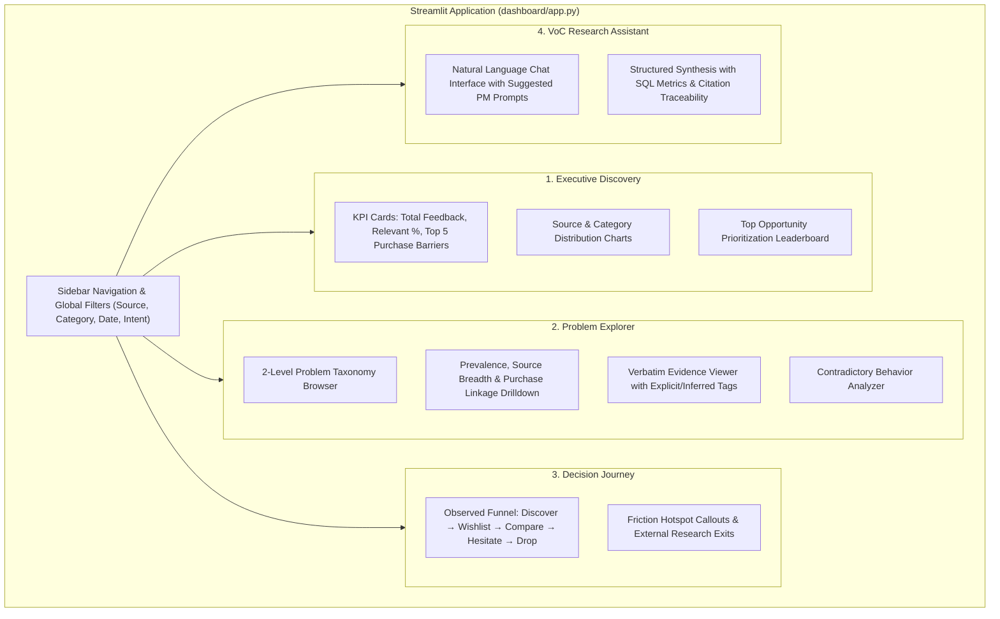

# Technical Architecture & System Design Document
## AI-Powered Voice-of-Customer (VoC) Wishlist-to-Purchase Discovery Engine

---

## 1. Executive Summary & Design Principles

The **AI-Powered Wishlist-to-Purchase Discovery Engine** is a specialized analytical platform designed to uncover the latent friction points, uncertainties, comparison behaviors, and unmet user needs that prevent e-commerce fashion shoppers from converting wishlisted products into completed purchases within 30 days.

```
+--------------------------------------------------------------------------------------------------+
|                                    CORE EPISTEMIC MANDATE                                        |
|  1. Observations != Hypotheses != Causal Claims                                                 |
|  2. LLMs are used for extraction, semantic synthesis, and interpretation — NEVER for math.       |
|  3. All metrics (prevalence, frequencies, rankings) are deterministically computed in SQL/Python.|
|  4. No monetary solution bias: Discover root customer problems first.                            |
+--------------------------------------------------------------------------------------------------+
```

### Core Architectural Principles
1. **Source Agnostic Downstream Processing**: Ingestion modules normalize all disparate sources into a strictly typed `raw_feedback` schema. All downstream AI, vector, and analytical modules operate purely on normalized records.
2. **Epistemic Traceability**: Every insight, metric, and problem cluster must trace back to verbatim user quotes, source IDs, explicit vs. inferred categorization, and confidence scores.
3. **Hybrid RAG (Analytical + Vector)**: Semantic vector retrieval provides qualitative context, while direct SQL execution provides deterministic statistical ground truth.
4. **Unsupervised Emerging Theme Discovery**: The system does not force feedback into rigid pre-defined buckets; HDBSCAN clustering on local BGE embeddings discovers emergent themes dynamically.
5. **Local-First & Resource Efficient**: Local BGE embedding models and local ChromaDB/SQLite stores eliminate recurring embedding API costs and cloud vendor lock-in.

---

## 2. End-to-End System Architecture



---

## 3. Data Ingestion Subsystem

The Ingestion layer adopts a unified `BaseCollector` interface to decouple specific data protocols from database storage.



### Ingestion Components & Strategies
1. **`YouTubeCollector` (`collectors/youtube_collector.py`)**:
   - Uses YouTube Data API v3.
   - Searches behavior-centric queries (e.g., *"Myntra haul sizing issue"*, *"online clothes purchase hesitation"*, *"AJIO quality review"*).
   - Paginates top-level comment threads and replies, extracts metadata (likes, dates, author).
2. **`HFDatasetLoader` (`collectors/hf_dataset_loader.py`)**:
   - Ingests **`jlh/uci-shopper`** (UCI Online Shoppers Purchasing Intention Dataset with 12,330 sessions) containing quantitative session duration (`Informational_Duration`, `ProductRelated_Duration`), `BounceRates`, `ExitRates`, `VisitorType`, and `Revenue` outcomes.
   - Ingests complementary fashion e-commerce customer feedback and review datasets.
   - Maps review text to `raw_feedback` and structured session logs to `shopper_sessions` table in SQLite.
3. **`WebSerperCollector` (`collectors/web_collector.py`)**:
   - Queries Google Search index via Serper API (`SERPER_API_KEY`) for Indian fashion discussions, reddit forum threads, and buyer hesitation articles.
   - Parses organic search snippets and deep forum posts.
4. **`RedditCollector` (`collectors/reddit_collector.py`)**:
   - Ingests public Reddit submissions and comments from subreddits (`r/IndianFashionAddicts`, `r/TwoXIndia`, `r/india`) via OAuth API or pre-collected dumps.

---

## 4. Processing, Relevance & AI Extraction Pipeline



### 1. Cleaning & Deduplication (`processing/cleaning.py`, `deduplication.py`)
- **Cleaning**: Strips broken HTML entities, emojis/control characters, promotional URLs, spam bots, and malformed encoding.
- **Exact Deduplication**: SHA-256 hash of normalized text.
- **Near Deduplication**: MinHash / Levenshtein distance matching for copied cross-posts and multi-platform promotional spam.

### 2. Relevance Classification (`processing/relevance.py`)
Classifies feedback on a strict 4-level scale using Groq LLM:
- `0 (Irrelevant)`: Spam, random text, non-fashion, bot output.
- `1 (Peripheral)`: General fashion chit-chat without decision-making context.
- `2 (Relevant)`: Discusses online fashion shopping, fit, sizing, quality, returns, or price perceptions.
- `3 (Highly Relevant)`: Explicitly discusses wishlist behavior, hesitation, postponement, cart abandonment, product comparison, or external research.

### 3. Structured Information Extraction (`ai/extraction.py`)
For all records with `relevance_score >= 2`, Groq extracts a strictly typed, nullable JSON object containing:
- **Intent**: `user_intent`, `wishlist_reason`, `purchase_intent`
- **Barriers & Friction**: `purchase_barrier`, `purchase_hesitation`, `purchase_postponement_reason`, `uncertainty_type`
- **Behavioral Indicators**: `decision_stage`, `behaviour_after_interest`, `comparison_behaviour`, `external_search_behaviour`
- **Specific Concerns (Flags)**: `fit_concern`, `size_concern`, `quality_concern`, `material_concern`, `styling_concern`, `trust_concern`, `return_exchange_concern`, `price_sensitivity`
- **Evidence Provenance**: `evidence_span` (verbatim substring), `evidence_type` (`explicit` vs `inferred`), `inferred_user_need`, `inference_confidence`

---

## 5. Machine Learning, Embeddings & Clustering Architecture



### Embedding Pipeline (`ai/embeddings.py`)
- Model: `BAAI/bge-small-en-v1.5` (Fast, lightweight 384-dimensional dense vectors running locally on CPU/GPU via `sentence-transformers`).
- Consistency: Same embedding model applied across feedback items, evidence spans, search queries, and cluster representations.

### Semantic Clustering & Problem Discovery (`ai/clustering.py`)
1. **Clustering Engine**: HDBSCAN (Hierarchical Density-Based Spatial Clustering of Applications with Noise) as primary algorithm, with Agglomerative / K-Means as fallbacks.
2. **Noise Isolation**: Isolates natural outliers without forcing random noise into predefined clusters.
3. **Automated Cluster Labeling**: Groq analyzes representative centroid exemplars per cluster to produce:
   - `cluster_label` (Concise naming)
   - `cluster_description` (Root cause synthesis)
   - `level_1_category` & `level_2_category` assignment
   - `sub_themes`

---

## 6. Deterministic Quantification, Segmentation & Opportunity Engine

The analytics engine operates strictly on deterministic SQL queries and Pandas operations.



### Quantification Mathematical Formulas

$$\text{Prevalence}(P) = \left( \frac{\sum_{i \in \text{Relevant}} \mathbb{I}(i \in P)}{|\text{Relevant Feedback}|} \right) \times 100$$

$$\text{Source Breadth}(P) = |\text{Unique Sources}(P)| \quad \text{where } \text{Sources} \in \{\text{youtube}, \text{reddit}, \text{huggingface}, \text{web}\}$$

$$\text{Explicit Rate}(P) = \left( \frac{\sum_{i \in P} \mathbb{I}(\text{evidence\_type} = \text{'explicit'})}{|P|} \right) \times 100$$

$$\text{Purchase Linkage Score}(P) = \left( \frac{\sum_{i \in P} \mathbb{I}(\text{outcome} \in \{\text{'postponed'}, \text{'abandoned'}, \text{'hesitated'}\})}{|P|} \right) \times 100$$

$$\text{Opportunity Score}(P) = w_1 \cdot \widetilde{\text{Prev}} + w_2 \cdot \widetilde{\text{Link}} + w_3 \cdot \widetilde{\text{Breadth}} + w_4 \cdot \widetilde{\text{Expl}} + w_5 \cdot \widetilde{\text{Conf}}$$

*Note: All weights $w_i$ sum to 1.0, generating a normalized score between 0 and 100 for PM roadmap prioritization.*

---

## 7. Storage Architecture & Relational Schemas



---

## 8. Hybrid RAG & PM Research Engine

The Research Engine solves the fundamental flaw of naive vector RAG (which cannot calculate sums or percentages accurately) by combining structured analytical queries with semantic context.



---

## 9. Streamlit Presentation Architecture



---

## 10. Project Directory & Component Mapping

```
AIwishlistDiscoveryEngine/
├── collectors/                   # Modular Data Ingestion Layer
│   ├── __init__.py
│   ├── base_collector.py         # Abstract Base Collector
│   ├── youtube_collector.py      # YouTube Data API v3 Ingestion
│   ├── hf_dataset_loader.py      # Hugging Face & Local Dataset Ingestion
│   ├── reddit_collector.py       # Reddit API & Dataset Ingestion
│   └── web_collector.py          # Serper Google Search API Ingestion
│
├── database/                     # Relational Persistence
│   ├── __init__.py
│   ├── schema.py                 # SQLite Schema Definitions & DDL
│   └── db.py                     # Connection Pooling, CRUD & Transaction Helpers
│
├── processing/                   # Data Transformation & Filtering
│   ├── __init__.py
│   ├── cleaning.py               # Text Normalization & Sanitization
│   ├── deduplication.py          # Exact (SHA256) & Near (MinHash) Deduplication
│   └── relevance.py              # Groq-based Relevance Scoring (0-3)
│
├── ai/                           # AI, ML & NLP Modules
│   ├── __init__.py
│   ├── groq_client.py            # Resilient Groq Client (Rate-limiting & Retries)
│   ├── extraction.py             # Structured Schema & User Need Extractor
│   ├── embeddings.py             # Local BGE Embedding Model Wrapper
│   └── clustering.py             # HDBSCAN / Semantic Clustering & Taxonomy
│
├── vector/                       # Vector Store Management
│   ├── __init__.py
│   └── chroma_store.py           # ChromaDB Client & Collection Management
│
├── analysis/                     # Deterministic Analytics Engine
│   ├── __init__.py
│   ├── metrics.py                # Frequency, Prevalence & Linkage Math
│   ├── segmentation.py           # Multi-dimensional Segmentation Slicing
│   └── opportunity.py            # Opportunity Scoring & Prioritization
│
├── rag/                          # Hybrid RAG & Synthesis Engine
│   ├── __init__.py
│   ├── retrieval.py              # Hybrid SQL + ChromaDB Dual Retriever
│   └── research_engine.py        # PM Q&A Orchestrator & Synthesizer
│
├── dashboard/                    # Presentation Layer
│   ├── __init__.py
│   ├── app.py                    # Main Streamlit Entrypoint
│   └── views/                    # Multi-page Views
│       ├── executive_view.py
│       ├── problem_explorer.py
│       ├── decision_journey.py
│       └── research_chat.py
│
├── prompts/                      # Version-Controlled LLM Prompts
│   ├── relevance_prompt.txt
│   ├── extraction_prompt.txt
│   └── research_prompt.txt
│
├── tests/                        # Test Suite (Unit & Pipeline Tests)
│   ├── test_collectors.py
│   ├── test_cleaning.py
│   ├── test_extraction.py
│   └── test_metrics.py
│
├── data/                         # Local Data Directory (Gitignored)
│   ├── raw/
│   └── processed/
│
├── .env.example                  # Environment Configuration Template
├── .gitignore
├── requirements.txt              # Production Dependencies
├── main.py                       # Pipeline CLI Orchestration
├── context.md                    # Problem & Blueprint Specification
├── architecture.md               # This System Architecture Document
└── README.md
```

---

## 11. Security, Rate Limiting & Reliability Safeguards

1. **Credential Isolation**: Zero hardcoded secrets. All API keys (`GROQ_API_KEY`, `YOUTUBE_API_KEY`, `SERPER_API_KEY`, `REDDIT_*`, `HF_TOKEN`) are loaded from `.env` via `python-dotenv`.
2. **API Resilience & Rate Limiting**:
   - Exponential backoff with jitter on Groq and YouTube API rate limit errors (HTTP 429).
   - Local token batching for Groq structured extraction.
3. **Zero Hallucination Grounding**:
   - Extraction prompts enforce strict extraction from provided text only.
   - LLM generation in RAG is grounded strictly in supplied SQL summary tables and retrieved ChromaDB quotes.
4. **Data Integrity & Immutability**:
   - `raw_feedback` table is strictly append-only; cleaning and processing never overwrite original text.
   - Evidence spans are preserved verbatim for full auditability.
